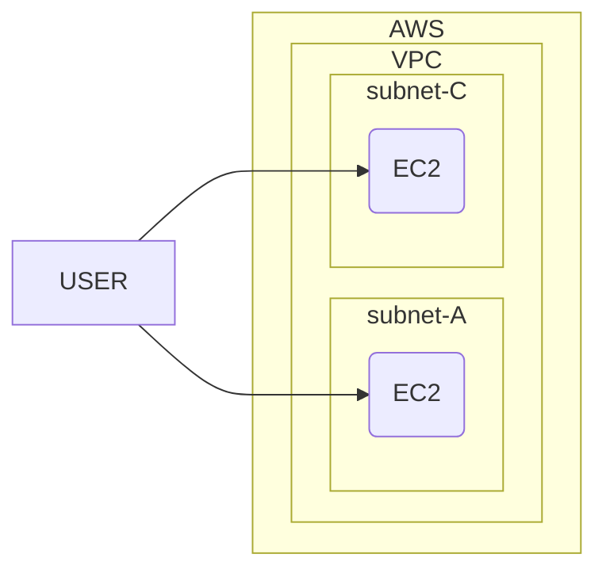

# AWS with Terraform

> 최종 과제로 무엇을 할까 고민하다 결국 내가 "가장 기본이 되는 기초를 정리해보자!"가 되었습니다. 개인적으로 가장 인상 깊었던 2번째 시간의 코드를 좀더 상세하게 정리하여 보았습니다.




## 1. [VPC](https://docs.aws.amazon.com/ko_kr/vpc/latest/userguide/configure-your-vpc.html)와 [subnet](https://docs.aws.amazon.com/ko_kr/vpc/latest/userguide/configure-subnets.html) 생성

> (Amazon VPC란 무엇인가?)[https://docs.aws.amazon.com/ko_kr/vpc/latest/userguide/what-is-amazon-vpc.html] 를 보면 자세하게 설명 되어 있지만, 간단하게 주요 기능은 아래와 같습니다. 

- VPC :  자체 데이터 센터에서 운영하는 기존 네트워크와 아주 유사한 가상 네트워크
- subnet : VPC의 ip 주소 범위
- IP 주소 지정 : VPC와 subnet에 IPv4 또는 IPv6 주소 할당
- 라우팅 : [라우팅 테이블](https://docs.aws.amazon.com/ko_kr/vpc/latest/userguide/VPC_Route_Tables.html)을 사용하여 서브넷 또는 게이트웨이의 네트워크 트래픽이 전달되는 위치를 결정
- 게이트웨이 및 엔드포인트 : [게이트웨이](https://docs.aws.amazon.com/ko_kr/vpc/latest/userguide/extend-intro.html)는 VPC를 다른 네트워크에 연결
- 피어링 연결: [VPC 피어링](https://docs.aws.amazon.com/vpc/latest/peering/what-is-vpc-peering.html) 연결을 사용하여 두 VPC의 리소스 간 트래픽을 라우팅
- 트래픽 미러링 :  네트워크 인터페이스에서 [네트워크 트래픽을 복사](https://docs.aws.amazon.com/vpc/latest/mirroring/what-is-traffic-mirroring.html)하고 심층 패킷 검사를 위해 보안 및 모니터링 어플라이언스로 전송
- Transit Gateway : 중앙 허브 역할을 하는 [전송 게이트웨이](https://docs.aws.amazon.com/ko_kr/vpc/latest/userguide/extend-tgw.html)를 사용하여 VPC, VPN 연결 및 AWS Direct Connect 연결 간에 트래픽을 라우팅
- VPC 흐름 로그 : [흐름 로그](https://docs.aws.amazon.com/ko_kr/vpc/latest/userguide/flow-logs.html)는 VPC의 네트워크 인터페이스로 들어오고 나가는 IP 트래픽에 대한 정보를 캡처
- VPN 연결 : [AWS Virtual Private Network(AWS VPN)](https://docs.aws.amazon.com/ko_kr/vpc/latest/userguide/vpn-connections.html)을 사용하여 온프레미스 네트워크에 VPC를 연결합니다.

```
# AWS 사용
provider "aws" {
  region = "ap-northeast-3" 
}

# vpc 생성 
resource "aws_vpc" "myvpc" {
  cidr_block       = "10.10.0.0/16"
  enable_dns_support   = true
  enable_dns_hostnames = true

  tags = {
    Name = "lahuman-study"
  }
}

# subnet-a 생성
resource "aws_subnet" "mysubnet1" {
  vpc_id     = aws_vpc.myvpc.id
  cidr_block = "10.10.1.0/24"

  availability_zone = "ap-northeast-3a"

  tags = {
    Name = "lahuman-subnet1"
  }
}

# subnet-b 생성
resource "aws_subnet" "mysubnet2" {
  vpc_id     = aws_vpc.myvpc.id
  cidr_block = "10.10.2.0/24"

  availability_zone = "ap-northeast-3d"

  tags = {
    Name = "lahuman-subnet2"
  }
}

# gateway 생성
resource "aws_internet_gateway" "myigw" {
  vpc_id = aws_vpc.myvpc.id

  tags = {
    Name = "lahuman-igw"
  }
}

# 라우팅 테이블 생성
resource "aws_route_table" "myrt" {
  vpc_id = aws_vpc.myvpc.id

  tags = {
    Name = "lahuman-rt"
  }
}

resource "aws_route_table_association" "myrtassociation1" {
  subnet_id      = aws_subnet.mysubnet1.id
  route_table_id = aws_route_table.myrt.id
}

resource "aws_route_table_association" "myrtassociation2" {
  subnet_id      = aws_subnet.mysubnet2.id
  route_table_id = aws_route_table.myrt.id
}

# 기본 라우팅 생성
resource "aws_route" "mydefaultroute" {
  route_table_id         = aws_route_table.myrt.id
  destination_cidr_block = "0.0.0.0/0"
  gateway_id             = aws_internet_gateway.myigw.id
}
```

## [보안 그룹 설정](https://docs.aws.amazon.com/ko_kr/vpc/latest/userguide/VPC_SecurityGroups.html)

> 보안 그룹은 연결된 리소스에 도달하고 나갈 수 있는 트래픽을 제어 합니다. VPC를 생성할 경우 VPC는 기본 보안 그룹과 함께 제공됩니다. 보안 그룹은 해당 보안 그룹이 생성된 VPC의 리소스에만 연결할 수 있습니다.
각 보안 그룹에 대해 프로토콜 및 포트 번호를 기반으로 트래픽을 제어하는 규칙을 추가합니다. 인바운드 트래픽과 아웃바운드 트래픽에 대한 규칙 집합은 따로 생성해야 합니다. 

```
# 보안 그룹 생성
resource "aws_security_group" "mysg" {
  vpc_id      = aws_vpc.myvpc.id
  name        = "lahuman SG"
  description = "lahuman Study SG"
}

# inbound 보안 그룹 생성
resource "aws_security_group_rule" "mysginbound" {
  type              = "ingress"
  from_port         = 0
  to_port           = 80
  protocol          = "tcp"
  cidr_blocks       = ["0.0.0.0/0"]
  security_group_id = aws_security_group.mysg.id
}

# outbound 보안 그룹 생성 
resource "aws_security_group_rule" "mysgoutbound" {
  type              = "egress"
  from_port         = 0
  to_port           = 0
  protocol          = "-1"
  cidr_blocks       = ["0.0.0.0/0"]
  security_group_id = aws_security_group.mysg.id
}
```

## [Ec2](https://aws.amazon.com/ko/ec2/features/?trk=ec2_landing) 생성

>  Amazon Elastic Compute Cloud(Amazon EC2)는 최신 프로세서, 스토리지, 네트워킹, 운영 체제 및 구매 모델의 옵션과 함께 워크로드의 요구 사항에 가장 잘 부합할 수 있도록 가장 포괄적이고 심층적인 컴퓨팅 플랫폼을 제공합니다. 

```
# ec2 image 값 가져오기
data "aws_ami" "my_amazonlinux2" {
  most_recent = true
  filter {
    name   = "owner-alias"
    values = ["amazon"]
  }

  filter {
    name   = "name"
    values = ["amzn2-ami-hvm-*-x86_64-ebs"]
  }

  owners = ["amazon"]
}

# ec2 생성
resource "aws_instance" "myec2" {

  depends_on = [
    aws_internet_gateway.myigw
  ]

  ami                         = data.aws_ami.my_amazonlinux2.id
  associate_public_ip_address = true
  instance_type               = "t2.micro"
  vpc_security_group_ids      = ["${aws_security_group.mysg.id}"]
  subnet_id                   = aws_subnet.mysubnet1.id

  user_data = <<-EOF
              #!/bin/bash
              wget https://busybox.net/downloads/binaries/1.31.0-defconfig-multiarch-musl/busybox-x86_64
              mv busybox-x86_64 busybox
              chmod +x busybox
              IID=$(curl 169.254.169.254/latest/meta-data/instance-id)
              LIP=$(curl 169.254.169.254/latest/meta-data/local-ipv4)
              echo "<h1>Instance ID($IID) : Private IP($LIP) : Web Server</h1>" > index.html
              nohup ./busybox httpd -f -p 80 &
              EOF

  user_data_replace_on_change = true

  tags = {
    Name = "lahuman"
  }
}

# ec2의 public IP를 전달
output "myec2_public_ip" {
  value       = aws_instance.myec2.public_ip
  description = "The public IP of the Instance"
}
```

## terraform 실행 

### [terraform plan](https://developer.hashicorp.com/terraform/cli/commands/plan)

> ```terraform plan``` 명령은 Terraform이 인프라에 적용할 계획인 변경 사항을 미리 볼 수 있는 실행 계획을 생성합니다. 

```bash
$ terraform plan

data.aws_ami.my_amazonlinux2: Reading...
data.aws_ami.my_amazonlinux2: Read complete after 1s [id=ami-0fb60a39693356bdc]

Terraform used the selected providers to generate the following execution plan. Resource actions are indicated with the following symbols:
  + create

Terraform will perform the following actions:

  # aws_instance.myec2 will be created
  + resource "aws_instance" "myec2" {
      + ami                                  = "ami-0fb60a39693356bdc"
      + arn                                  = (known after apply)
      + associate_public_ip_address          = true
      + availability_zone                    = (known after apply)
      + cpu_core_count                       = (known after apply)
      + cpu_threads_per_core                 = (known after apply)
      + disable_api_stop                     = (known after apply)
      + disable_api_termination              = (known after apply)
      + ebs_optimized                        = (known after apply)
      + get_password_data                    = false
      + host_id                              = (known after apply)
      + host_resource_group_arn              = (known after apply)
      + iam_instance_profile                 = (known after apply)
      + id                                   = (known after apply)
      + instance_initiated_shutdown_behavior = (known after apply)
      + instance_state                       = (known after apply)
      + instance_type                        = "t2.micro"
      + ipv6_address_count                   = (known after apply)
      + ipv6_addresses                       = (known after apply)
      + key_name                             = (known after apply)
      + monitoring                           = (known after apply)
      + outpost_arn                          = (known after apply)
      + password_data                        = (known after apply)
      + placement_group                      = (known after apply)
      + placement_partition_number           = (known after apply)
      + primary_network_interface_id         = (known after apply)
      + private_dns                          = (known after apply)
      + private_ip                           = (known after apply)
      + public_dns                           = (known after apply)
      + public_ip                            = (known after apply)
      + secondary_private_ips                = (known after apply)
      + security_groups                      = (known after apply)
      + source_dest_check                    = true
      + subnet_id                            = (known after apply)
      + tags                                 = {
          + "Name" = "HallsHolicker-jjang"
        }
      + tags_all                             = {
          + "Name" = "HallsHolicker-jjang"
        }
      + tenancy                              = (known after apply)
      + user_data                            = "8dff34d47d3190dd73611d8dd3ac482ed408aa71"
      + user_data_base64                     = (known after apply)
      + user_data_replace_on_change          = true
      + vpc_security_group_ids               = (known after apply)

      + capacity_reservation_specification {
          + capacity_reservation_preference = (known after apply)

          + capacity_reservation_target {
              + capacity_reservation_id                 = (known after apply)
              + capacity_reservation_resource_group_arn = (known after apply)
            }
        }

      + ebs_block_device {
          + delete_on_termination = (known after apply)
          + device_name           = (known after apply)
          + encrypted             = (known after apply)
          + iops                  = (known after apply)
          + kms_key_id            = (known after apply)
          + snapshot_id           = (known after apply)
          + tags                  = (known after apply)
          + throughput            = (known after apply)
          + volume_id             = (known after apply)
          + volume_size           = (known after apply)
          + volume_type           = (known after apply)
        }

      + enclave_options {
          + enabled = (known after apply)
        }

      + ephemeral_block_device {
          + device_name  = (known after apply)
          + no_device    = (known after apply)
          + virtual_name = (known after apply)
        }

      + maintenance_options {
          + auto_recovery = (known after apply)
        }

      + metadata_options {
          + http_endpoint               = (known after apply)
          + http_put_response_hop_limit = (known after apply)
          + http_tokens                 = (known after apply)
          + instance_metadata_tags      = (known after apply)
        }

      + network_interface {
          + delete_on_termination = (known after apply)
          + device_index          = (known after apply)
          + network_card_index    = (known after apply)
          + network_interface_id  = (known after apply)
        }

      + private_dns_name_options {
          + enable_resource_name_dns_a_record    = (known after apply)
          + enable_resource_name_dns_aaaa_record = (known after apply)
          + hostname_type                        = (known after apply)
        }

      + root_block_device {
          + delete_on_termination = (known after apply)
          + device_name           = (known after apply)
          + encrypted             = (known after apply)
          + iops                  = (known after apply)
          + kms_key_id            = (known after apply)
          + tags                  = (known after apply)
          + throughput            = (known after apply)
          + volume_id             = (known after apply)
          + volume_size           = (known after apply)
          + volume_type           = (known after apply)
        }
    }

  # aws_internet_gateway.myigw will be created
  + resource "aws_internet_gateway" "myigw" {
      + arn      = (known after apply)
      + id       = (known after apply)
      + owner_id = (known after apply)
      + tags     = {
          + "Name" = "lahuman-igw"
        }
      + tags_all = {
          + "Name" = "lahuman-igw"
        }
      + vpc_id   = (known after apply)
    }

  # aws_route.mydefaultroute will be created
  + resource "aws_route" "mydefaultroute" {
      + destination_cidr_block = "0.0.0.0/0"
      + gateway_id             = (known after apply)
      + id                     = (known after apply)
      + instance_id            = (known after apply)
      + instance_owner_id      = (known after apply)
      + network_interface_id   = (known after apply)
      + origin                 = (known after apply)
      + route_table_id         = (known after apply)
      + state                  = (known after apply)
    }

  # aws_route_table.myrt will be created
  + resource "aws_route_table" "myrt" {
      + arn              = (known after apply)
      + id               = (known after apply)
      + owner_id         = (known after apply)
      + propagating_vgws = (known after apply)
      + route            = (known after apply)
      + tags             = {
          + "Name" = "lahuman-rt"
        }
      + tags_all         = {
          + "Name" = "lahuman-rt"
        }
      + vpc_id           = (known after apply)
    }

  # aws_route_table_association.myrtassociation1 will be created
  + resource "aws_route_table_association" "myrtassociation1" {
      + id             = (known after apply)
      + route_table_id = (known after apply)
      + subnet_id      = (known after apply)
    }

  # aws_route_table_association.myrtassociation2 will be created
  + resource "aws_route_table_association" "myrtassociation2" {
      + id             = (known after apply)
      + route_table_id = (known after apply)
      + subnet_id      = (known after apply)
    }

  # aws_security_group.mysg will be created
  + resource "aws_security_group" "mysg" {
      + arn                    = (known after apply)
      + description            = "lahuman Study SG"
      + egress                 = (known after apply)
      + id                     = (known after apply)
      + ingress                = (known after apply)
      + name                   = "lahuman SG"
      + name_prefix            = (known after apply)
      + owner_id               = (known after apply)
      + revoke_rules_on_delete = false
      + tags_all               = (known after apply)
      + vpc_id                 = (known after apply)
    }

  # aws_security_group_rule.mysginbound will be created
  + resource "aws_security_group_rule" "mysginbound" {
      + cidr_blocks              = [
          + "0.0.0.0/0",
        ]
      + from_port                = 0
      + id                       = (known after apply)
      + protocol                 = "tcp"
      + security_group_id        = (known after apply)
      + security_group_rule_id   = (known after apply)
      + self                     = false
      + source_security_group_id = (known after apply)
      + to_port                  = 80
      + type                     = "ingress"
    }

  # aws_security_group_rule.mysgoutbound will be created
  + resource "aws_security_group_rule" "mysgoutbound" {
      + cidr_blocks              = [
          + "0.0.0.0/0",
        ]
      + from_port                = 0
      + id                       = (known after apply)
      + protocol                 = "-1"
      + security_group_id        = (known after apply)
      + security_group_rule_id   = (known after apply)
      + self                     = false
      + source_security_group_id = (known after apply)
      + to_port                  = 0
      + type                     = "egress"
    }

  # aws_subnet.mysubnet1 will be created
  + resource "aws_subnet" "mysubnet1" {
      + arn                                            = (known after apply)
      + assign_ipv6_address_on_creation                = false
      + availability_zone                              = "us-east-2a"
      + availability_zone_id                           = (known after apply)
      + cidr_block                                     = "10.10.1.0/24"
      + enable_dns64                                   = false
      + enable_resource_name_dns_a_record_on_launch    = false
      + enable_resource_name_dns_aaaa_record_on_launch = false
      + id                                             = (known after apply)
      + ipv6_cidr_block_association_id                 = (known after apply)
      + ipv6_native                                    = false
      + map_public_ip_on_launch                        = false
      + owner_id                                       = (known after apply)
      + private_dns_hostname_type_on_launch            = (known after apply)
      + tags                                           = {
          + "Name" = "lahuman-subnet1"
        }
      + tags_all                                       = {
          + "Name" = "lahuman-subnet1"
        }
      + vpc_id                                         = (known after apply)
    }

  # aws_subnet.mysubnet2 will be created
  + resource "aws_subnet" "mysubnet2" {
      + arn                                            = (known after apply)
      + assign_ipv6_address_on_creation                = false
      + availability_zone                              = "us-east-2d"
      + availability_zone_id                           = (known after apply)
      + cidr_block                                     = "10.10.2.0/24"
      + enable_dns64                                   = false
      + enable_resource_name_dns_a_record_on_launch    = false
      + enable_resource_name_dns_aaaa_record_on_launch = false
      + id                                             = (known after apply)
      + ipv6_cidr_block_association_id                 = (known after apply)
      + ipv6_native                                    = false
      + map_public_ip_on_launch                        = false
      + owner_id                                       = (known after apply)
      + private_dns_hostname_type_on_launch            = (known after apply)
      + tags                                           = {
          + "Name" = "lahuman-subnet2"
        }
      + tags_all                                       = {
          + "Name" = "lahuman-subnet2"
        }
      + vpc_id                                         = (known after apply)
    }

  # aws_vpc.myvpc will be created
  + resource "aws_vpc" "myvpc" {
      + arn                                  = (known after apply)
      + cidr_block                           = "10.10.0.0/16"
      + default_network_acl_id               = (known after apply)
      + default_route_table_id               = (known after apply)
      + default_security_group_id            = (known after apply)
      + dhcp_options_id                      = (known after apply)
      + enable_classiclink                   = (known after apply)
      + enable_classiclink_dns_support       = (known after apply)
      + enable_dns_hostnames                 = true
      + enable_dns_support                   = true
      + enable_network_address_usage_metrics = (known after apply)
      + id                                   = (known after apply)
      + instance_tenancy                     = "default"
      + ipv6_association_id                  = (known after apply)
      + ipv6_cidr_block                      = (known after apply)
      + ipv6_cidr_block_network_border_group = (known after apply)
      + main_route_table_id                  = (known after apply)
      + owner_id                             = (known after apply)
      + tags                                 = {
          + "Name" = "lahuman-study"
        }
      + tags_all                             = {
          + "Name" = "lahuman-study"
        }
    }

Plan: 12 to add, 0 to change, 0 to destroy.

Changes to Outputs:
  + myec2_public_ip = (known after apply)
```


### [terraform apply](https://developer.hashicorp.com/terraform/cli/commands/apply)

> terraform apply 명령은 Terraform 계획에서 제안된 작업을 실행합니다.

```bash
$ terraform apply
...
Apply complete! Resources: 12 added, 0 changed, 0 destroyed.

Outputs:

myec2_public_ip = "18.218.237.189"
```

### 테스트

> 배포된 리소스들이 문제 없이 동작하는지 확인해봅니다. 실제 테스트를 위해서 작업 실행 후 1~2분 정도 시간이 지나야 동작 됩니다. 


```bash
# terraform apply 실행후 바로 실행시 오류 발생 
$ MYIP=$(terraform output -raw myec2_public_ip)
 $ while true; do curl --connect-timeout 1  http://$MYIP/ ; echo "------------------------------"; date; sleep 1; done
curl: (7) Failed to connect to 18.218.237.189 port 80 after 194 ms: Connection refused
------------------------------
Wed Dec  7 16:09:09 KST 2022
curl: (7) Failed to connect to 18.218.237.189 port 80 after 198 ms: Connection refused
------------------------------
```

```bash
# 1분 이후 실행시 정상 동작
$ MYIP=$(terraform output -raw myec2_public_ip)
$ while true; do curl --connect-timeout 1  http://$MYIP/ ; echo "------------------------------"; date; sleep 1; done
<h1>Instance ID(i-0ae32a65e09bf78f2) : Private IP(10.10.1.30) : Web Server</h1>
------------------------------
Wed Dec  7 16:10:30 KST 2022
<h1>Instance ID(i-0ae32a65e09bf78f2) : Private IP(10.10.1.30) : Web Server</h1>
------------------------------
Wed Dec  7 16:10:31 KST 2022
<h1>Instance ID(i-0ae32a65e09bf78f2) : Private IP(10.10.1.30) : Web Server</h1>
------------------------------
Wed Dec  7 16:10:33 KST 2022
<h1>Instance ID(i-0ae32a65e09bf78f2) : Private IP(10.10.1.30) : Web Server</h1>
------------------------------
```

### [terraform destroy](https://developer.hashicorp.com/terraform/cli/commands/destroy)

> terraform destroy 명령은 특정 Terraform 구성에서 관리하는 모든 원격 객체를 삭제합니다.

```bash
$ terraform destroy
aws_vpc.myvpc: Destruction complete after 1s

Destroy complete! Resources: 12 destroyed.
```

